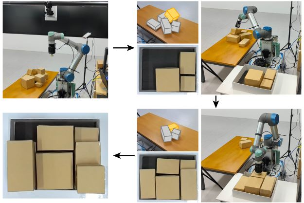
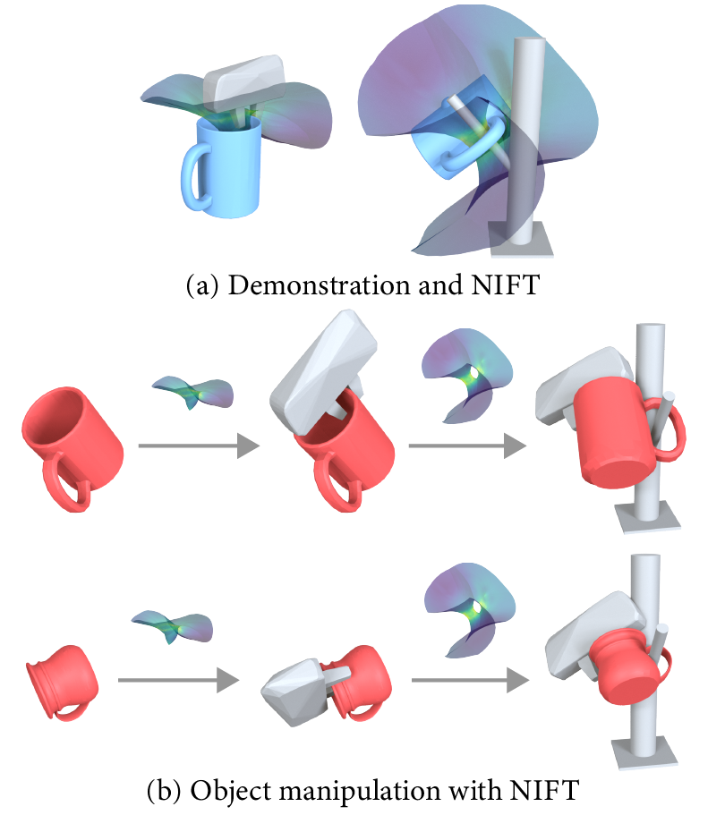
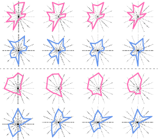

### Hi there 👋
<!-- ### 你好👋，我是许聚展 -->

<!-- ######################################################## -->

- 🔭 I’m currently a Ph.D. student in Computer Science supervised by Prof. Ruizhen Hu, working in Visual Computing Research Center, Shenzhen University.
- 🌱 I am interested in Computer Graphics, Robotics and Reinforcement Learning.
- 🪵 I am also learning about blender.

### Research

#### [Neural Packing: from Visual Sensing to Reinforcement Learning](https://vcc.tech/research/2023/TAPNet++)

Juzhan Xu, 
<a href="http://socs.uoguelph.ca/~minglun/">Minglun Gong</a>, 
<a href="http://www.cs.sfu.ca/~haoz/">Hao Zhang</a>, 
<a href="http://vcc.szu.edu.cn/~huihuang/">Hui Huang</a> and 
<a href="https://csse.szu.edu.cn/staff/ruizhenhu/index.htm">Ruizhen Hu</a>

ACM Transactions on Graphics (Proc. SIGGRAPH Asia), 42(6), 2023.

A novel learning framework to solve the transport-and-packing (TAP) problem in 3D.

 

<!-- ######################################################## -->

#### [NIFT: Neural Interaction Field and Template for Object Manipulation](https://vcc.tech/research/2023/NIFT)

<a href="https://zzilch.github.io/">Zeyu Huang</a>, 
Juzhan Xu, 
<a href="#">Sisi Dai</a>, 
<a href="http://kevinkaixu.net/">Kai Xu</a>, 
<a href="http://www.cs.sfu.ca/~haoz/">Hao Zhang</a>, 
<a href="http://vcc.szu.edu.cn/~huihuang/">Hui Huang</a> and 
<a href="https://csse.szu.edu.cn/staff/ruizhenhu/index.htm">Ruizhen Hu</a>

IEEE International Conference on Robotics and Automation (ICRA), 2023.

We introduce NIFT, Neural Interaction Field and Template, a descriptive and robust interaction representation of object manipulations to facilitate imitation learning.

 

More researchs

<!-- ######################################################## -->

#### [Learning High-DOF Reaching-and-Grasping via Dynamic Representation of Gripper-Object Interaction](https://vcc.tech/research/2022/Grasping)

<a href="#">Qijin She</a>, 
<a href="https://csse.szu.edu.cn/staff/ruizhenhu/index.htm">Ruizhen Hu</a>, 
Juzhan Xu, 
<a href="#">Min Liu</a>, 
<a href="http://kevinkaixu.net/">Kai Xu</a> and 
<a href="http://vcc.szu.edu.cn/~huihuang/">Hui Huang</a>

ACM Transactions on Graphics (Proc. SIGGRAPH), 41(4): 97, 2022.

We approach the problem of high-DOF reaching-and-grasping via learning joint planning of grasp and motion with deep reinforcement learning.

 

<!-- ######################################################## -->

#### [UprightRL: Upright Orientation Estimation of 3D Shapes via Reinforcement Learning](https://vcc.tech/research/2021/UprightRL)

<a href="#">Luanmin Chen</a>, 
Juzhan Xu, 
<a href="#">Chuan Wang</a>, 
<a href="https://brotherhuang.github.io/">Haibin Huang</a>, 
<a href="http://vcc.szu.edu.cn/~huihuang/">Hui Huang</a> and 
<a href="https://csse.szu.edu.cn/staff/ruizhenhu/index.htm">Ruizhen Hu</a>

Computer Graphics Forum (Proc. Pacific Graphics), 2021.

In this paper, we study the problem of 3D shape upright orientation estimation from the perspective of reinforcement learning.

 

<!-- ######################################################## -->

#### [Shape-driven Coordinate Ordering for Star Glyph Sets via Reinforcement Learning](https://vcc.tech/research/2021/STAR)

<a href="https://csse.szu.edu.cn/staff/ruizhenhu/index.htm">Ruizhen Hu</a>, 
<a href="#">Bin Chen</a>, 
Juzhan Xu, 
<a href="http://people.scs.carleton.ca/~olivervankaick/index.html">Oliver van Kaick</a>, 
<a href="https://www.cgmi.uni-konstanz.de/">Oliver Deussen</a> and 
<a href="http://vcc.szu.edu.cn/~huihuang/">Hui Huang</a>

IEEE Transactions on Visualization and Computer Graphics, 2021.

We present a neural optimization model trained with reinforcement learning to solve the coordinate ordering problem for sets of star glyphs.

 

<!-- ######################################################## -->

#### [TAP-Net: Transport-and-Pack using Reinforcement Learning](https://vcc.tech/research/2020/TAP)

<a href="https://csse.szu.edu.cn/staff/ruizhenhu/index.htm">Ruizhen Hu</a>, 
Juzhan Xu, 
<a href="#">Bin Chen</a>, 
<a href="http://socs.uoguelph.ca/~minglun/">Minglun Gong</a>, 
<a href="http://www.cs.sfu.ca/~haoz/">Hao Zhang</a> and 
<a href="http://vcc.szu.edu.cn/~huihuang/">Hui Huang</a>

ACM Transactions on Graphics (Proc. SIGGRAPH Asia), 42(6), 2020.

We introduce the transport-and-pack (TAP) problem, a frequently encountered instance of real-world packing, and develop a neural optimization solution based on reinforcement learning.

 

